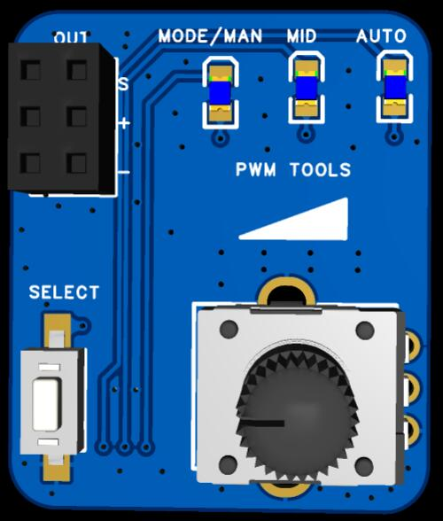

# Servo Test Tool base on CH32V003

* [Introduction](https://github.com/TianpeiLee/ServoTestTool#Introduction) 
* [Mode](https://github.com/TianpeiLee/ServoTestTool#Mode) 

## Introduction

This is a servo testing tool program that can be directly compiled and downloaded through MRS. 
It can output 50Hz PWM signals, Dshot300 signals, and Dshot600 signals for testing servo or electronic speed controllers (ESC).
The controller is a 32-bit RISC-V chip with high cost-effectiveness,which can be detailed in the [schematic diagram](https://github.com/TianpeiLee/ServoTestTool/blob/main/ServoTest_SCH.pdf). 

PCB is:  

## Mode

